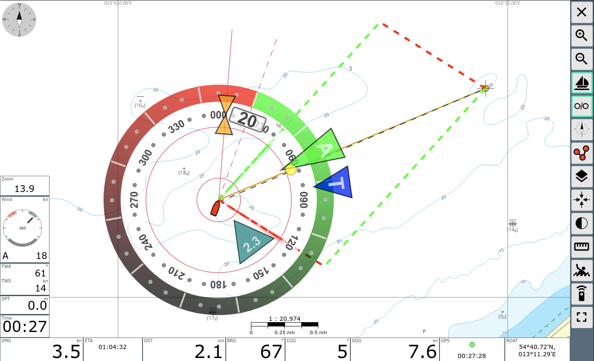

# SailInstrument AvNav-Plugin

The idea of this plugin is to display an instrument, that contains all basic information needed for sailing.
The Instrument is inspired by B&G's sailsteer.  
With the possibility to show the instrument directly on the map at the boat position the sailor has all information in view. The laylines will inform you about the course for optimal VMG upwind and if displayed on the map you can follow these lines. 

Basically this plugin uses the [AvNav Plugin Interface](https://www.wellenvogel.net/software/avnav/docs/hints/plugins.html?lang=en).

There is a good description of what you can do with it at [blauwasser.de](https://www.blauwasser.de/navigation/app-sailsteer-bandg) and [mark-chisnell](https://www.bandg.com/de-de/blog/sailsteer-with-mark-chisnell/).

The plugin calculates true wind, ground wind and set and drift. It needs COG/SOG, HDT/STW and AWA/AWS and input data. If HDT/STW is missing it uses COG/SOG as fallback (you get ground wind instead of true wind, and the direction is wrong if HDT!=COG). If you do not have a wind sensor, you can enter ground wind in the settings for testing purposes.

The values calculated by the plugin are published in AvNav under `gps.sailinstrument.*`. The following values are computed

| quantity | meaning                                      | 
|----------|----------------------------------------------|
| AWA      | apparent wind angle                          |
| AWD      | apparent wind direction                      |
| AWDF     | apparent wind direction, filtered (smoothed) |
| AWS      | apparent wind speed                          |
| AWSF     | apparent wind speed filtered                 |
| COG      | course over ground                           |
| DFT      | tide drift rate                              |
| DFTF     | tide drift rate filtered                     |
| GWA      | ground wind angle                            |
| GWD      | ground wind direction                        |
| GWS      | ground wind speed                            |
| HDT      | true heading                                 |
| LEE      | leeway angle (currently 0)                   |
| LLBB     | port layline direction                       |
| LLSB     | starboard layline direction                  |
| SET      | tide set direction                           |
| SETF     | tide set direction filtered                  |
| SOG      | speed over ground                            |
| STW      | speed through water                          |
| TWA      | true wind angle                              |
| TWD      | true wind direction                          |
| TWDF     | true wind direction filtered                 |
| TWDMAX   | max true wind direction relative to TWDF     |
| TWDMIN   | min true wind direction relative to TWDF     |
| TWS      | true wind speed                              |
| TWSF     | true wind speed filtered                     |
| VMCD     | optimum VMC direction (course)               |
| VMCS     | optimum VMC speed                            |
| VPOL     | speed from polar                             |

Optionally you can enable that i.e. `gps.trueWindAngle` is written ot the AvNav data (requires `allowKeyOverwrite=true`). 

## Installation

Place the `Sail_Instrument` folder inside `avnav/data/plugins` or install the provided deb package from the releases.

You have to provide polar data for your boat in `avnav/user/viewer` for calculating the laylines. If there is no `polar.xml` file in the user folder, the plugin will copy its own file to this location and you can use it as a template for your own polar data.
If you do not have polar data, you can enter tack and gybe angle in the plugin configuration and use these fixed values instead.
  
A source for polar data can be [Zeilersforum.nl](http://jieter.github.io/orc-data/site/index.html?#ITAEVERG)(thanks to [Segeln-Forum](https://www.segeln-forum.de/thread/61813-messbriefe-und-polardaten-online-nachschauen/)) or [Seapilot.com](https://www.seapilot.com/wp-content/uploads/2018/05/All_polar_files.zip)(thanks to [free-x](https://github.com/free-x)).

In the polar data you find beat angle and run angle. These two vectors are needed for the calculation of the laylines.  
The boat speed matrix is only used for calculation of VPOL and optimal VMC course.

## Laylines

To understand the technical background of the laylines one has first to have an understanding of the terms VMG & VMC.
VMG (Velocity made good against wind) is defined as VMG = boatspeed * cos(TWA), so meaning the fastest course upwind.
VMC (Velocity made good on course) is defined as VMC = boatspeed * cos(BRG-HDG), meaning the fastest course towards the waypoint.
Unfortunately there is a lot of confusion on these two terms and also most of the commercial products are mixing the two items and indicate VMG but actually showing VMC (and so does AvNav). The calculation of laylines is based on the upwind and downwind vectors in your polar file, which contain the TWA for maximum VMG for a given TWS. As a result laylines show the optimum VMG angle, but not optimum VMC angle from TWD.  

This plugin also calculates the optimum VMC course from the polar data and displays it as a blue line along with the laylines.
