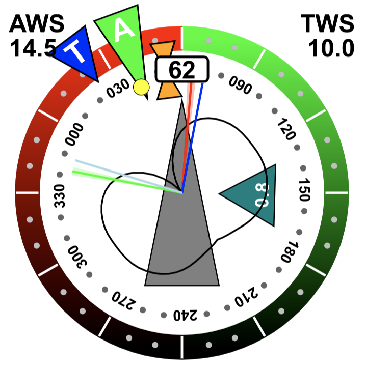

# SailInstrument AvNav-Plugin

The idea of this [plugin for AvNav](https://www.wellenvogel.net/software/avnav/docs/hints/plugins.html) is to display an instrument, that contains all basic information needed for sailing.
The Instrument is inspired by B&G's sailsteer.  
With the possibility to show the instrument directly on the map at the boat position the sailor has all information in view.
The laylines will inform you about the course for optimal VMG upwind and if displayed on the map you can follow these lines. 
There is a good description of what you can do with it at [blauwasser.de](https://www.blauwasser.de/navigation/app-sailsteer-bandg) and [mark-chisnell](https://www.bandg.com/de-de/blog/sailsteer-with-mark-chisnell/).

## Calculated Data

The plugin calculates true wind, ground wind and set and drift. It needs COG/SOG, HDT/STW and AWA/AWS as input data. If HDT/STW is missing it uses COG/SOG as fallback (you get ground wind instead of true wind, and the direction is wrong if HDT!=COG). If you do not have a wind sensor, you can enter ground wind in the settings for testing purposes.

How the calculation is done and the formulas used as well definitions of the several quantities, all of this is [documented in the code](Sail_Instrument/plugin.py#L428).

The values calculated by the plugin are published in AvNav as `gps.sailinstrument.*`. 
Optionally you can enable that some of these quantities are written to their well-defined AvNav paths to make them available to widgets or other plugins.
The plugin never overwrites data that origins from other sources.
The following values are computed or copied from their sources.

| quantity | meaning                                  | path                    | 
|----------|------------------------------------------|-------------------------|
| AWA      | apparent wind angle                      | gps.windAngle           |
| AWD      | apparent wind direction                  |                         |
| AWDF     | apparent wind direction, filtered        |                         |
| AWS      | apparent wind speed                      | gps.windSpeed           |
| AWSF     | apparent wind speed filtered             |                         |
| COG      | course over ground                       |                         |
| DFT      | tide drift rate                          | gps.currentDrift        |
| DFTF     | tide drift rate filtered                 |                         |
| GWA      | ground wind angle                        | gps.groundWindAngle     |
| GWD      | ground wind direction                    | gps.groundWindDirection |
| GWS      | ground wind speed                        | gps.groundWindSpeed     |
| HDT      | true heading                             |                         |
| HEL      | heel angle                               |                         |
| LEE      | leeway angle                             |                         |
| LEF      | leeway factor                            |                         |
| LLBB     | port layline direction                   |                         |
| LLSB     | starboard layline direction              |                         |
| SET      | tide set direction                       | gps.currentSet          |
| SETF     | tide set direction filtered              |                         |
| SOG      | speed over ground                        |                         |
| STW      | speed through water                      |                         |
| TWA      | true wind angle                          | gps.trueWindAngle       |
| TWD      | true wind direction                      | gps.trueWindDirection   |
| TWDF     | true wind direction filtered             |                         |
| TWDMAX   | max true wind direction relative to TWDF |                         |
| TWDMIN   | min true wind direction relative to TWDF |                         |
| TWS      | true wind speed                          | gps.trueWindSpeed       |
| TWSF     | true wind speed filtered                 |                         |
| VMCA     | optimum VMC direction (course)           |                         |
| VMCB     | optimum VMC direction (opposite tack)    |                         |
| VPOL     | speed from polar                         |                         |

## Config Options

There are the following config options.

- `smoothing_factor` - factor within (0,1] for [exponential smoothing](https://en.wikipedia.org/wiki/Exponential_smoothing) (filtering) of wind and tide, 1 = no smoothing, filtered data as suffix `F`
- `minmax_samples` - number of samples used for calculating min/max TWD
- `allow_fallback` - allow fallback to use COG/SOG if HDT/STW is not available
- `tack_angle` - tack angle [0,180) used for laylines, if >0 this fixed angle is used instead the one from the polar data 
- `gybe_angle` - gybe angle [0,180) used for laylines, if >0 this fixed angle is used instead the one from the polar data 
- `write_data` - write calculated data to their well-defined AvNav paths, requires `allowKeyOverwrite=true`
- `ground_wind` - manually entered ground wind as `direction,speed`, used to calculate true and apparent wind if no other wind data is present (for simulation)
- `calc_vmc` - perform calculation of optimal TWA for maximum VMC (see below)
- `laylines_from_matrix` - calculate laylines from speed matrix, not from beat/run angle in polar data
- `lee_factor` - leeway factor, if >0 leeway angle is estimated, see below

## Installation

Place the `Sail_Instrument` folder inside `avnav/data/plugins`.

## Polar Data

You have to provide polar data for your boat in `avnav/user/viewer/polar.json` for calculating the laylines. If there is no such file, the plugin will copy [one](Sail_Instrument/polar.json) to this location, and you can use it as a template for your own polar data.

If you do not have any polar data, you can enter tack and gybe angle in the plugin configuration and use these fixed values instead.
  
A source for polar data can be [ORC sailboat data](https://jieter.github.io/orc-data/site/) or [Seapilot.com](https://www.seapilot.com/features/download-polar-files/).

## Leeway estimation

Leeway is [estimated from heel and STW](https://opencpn-manuals.github.io/main/tactics/index.html#_2_2_calculate_leeway) as

LEE = LEF * HEL / STW^2

With LEF being a boat specific factor from within (0,20). Heel could be measured but here it is interpolated from the heel polar in `heel.json`. As the boat speed polar it contains an interpolation table to map TWA/TWS to heel angle HEL. 

## Laylines

To understand the technical background of the laylines one has first to have an understanding of the terms VMG and VMC.

- **VMG** - _Velocity Made Good against wind_ is defined as `VMG = boatspeed * cos(TWA)` boatspeed vector projected onto true wind direction
- **VMC** - _Velocity Made good on Course_ is defined as `VMC = boatspeed * cos(BRG-HDG)` boatspeed vector projected onto direction to waypoint

Unfortunately there is a lot of confusion on these two terms and also most of the commercial products are mixing the two items and indicate VMG but actually showing VMC (and so does AvNav). 

The laylines are computed from the `beat_angle` and `run_angle` vectors in the polar file, which contain a mapping of TWS to TWA for maximum VMG. As a result the laylines show the optimal TWA to travel upwind in general, but not the optimal TWA to get towards the waypoint.  Optionally it is possible to calculate the laylines from the STW matrix.

From the `STW` matrix in the polar data, which is a mapping of TWS and TWA to STW, one can calculate the optimal TWA such that VMC is maximised, the optimal TWA that gets you fasted towards the waypoint. The plugin calculates this optimal TWA from the polar data and displays it as a blue line along with the laylines. 

These calculations require `numpy.interp`, `scipy.interpolate` and `scipy.optimize` to be installed. 
