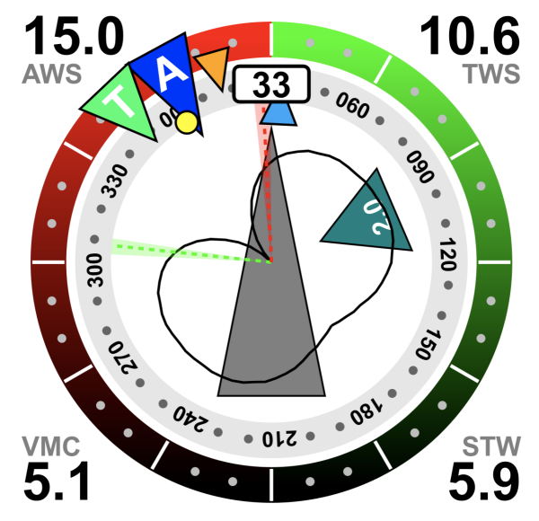
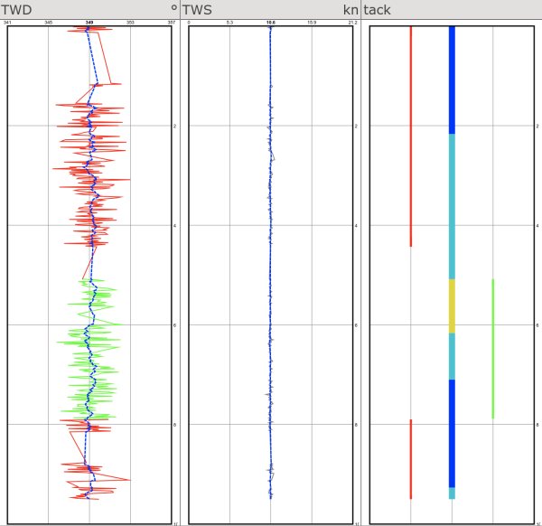

# Sail_Instrument Plugin

This plugin for [AvNav](https://www.wellenvogel.net/software/avnav/docs/beschreibung.html?lang=en) is inspired by the [B&G's sailsteer](https://www.bandg.com/de-de/blog/sailsteer-with-mark-chisnell/) display.

The documentation can be found in the [`docs` directory](docs/0-Documentation.md).

