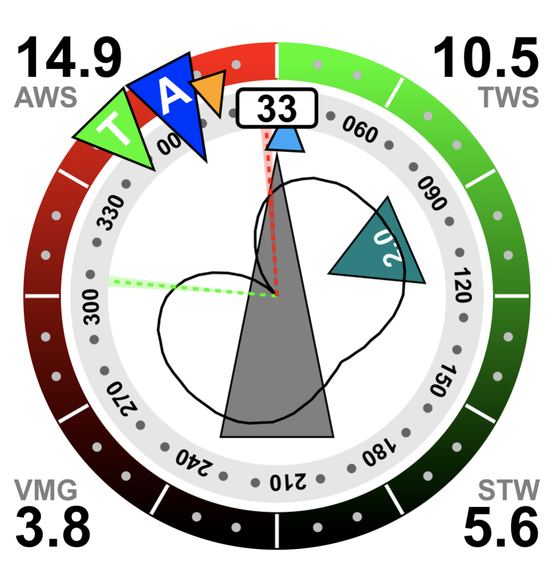
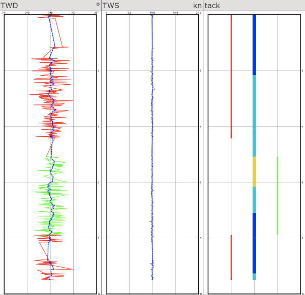
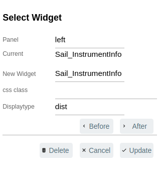
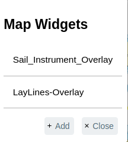
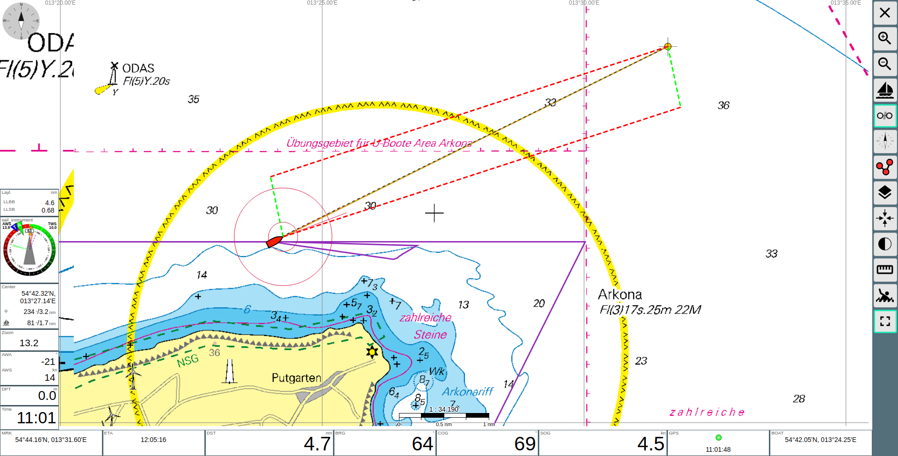
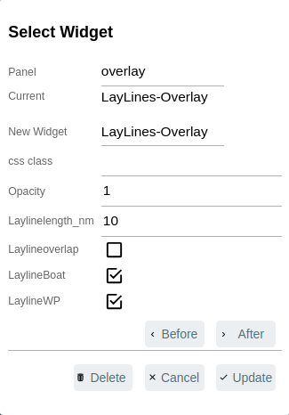
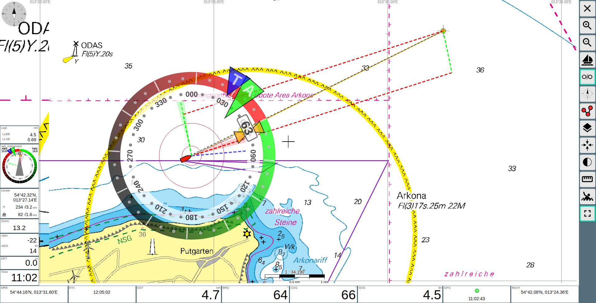

# The Server-Part

Going to the [Server/Status-Page](https://www.wellenvogel.net/software/avnav/docs/userdoc/statuspage.html?lang=en) in the PluginHandler Section you will find the SailInstrument plugin in the PluginHandler-Section with the following configuration options for the server part:

- `period` - computation interval (s)
- `smoothing_factor` - factor within (0,1] for [exponential smoothing](https://en.wikipedia.org/wiki/Exponential_smoothing) (filtering) of wind and tide, 1 = no smoothing, filtered data as suffix `F`
- `minmax_samples` - number of samples used for calculating min/max TWD
- `allow_fallback` - allow fallback to use HDT=COG and/or STW=SOG if former are not available
- `calc_vmc` - perform calculation of optimal TWA for maximum VMC (see below)
- `laylines_polar` - calculate laylines from speed matrix, not from beat/run angle in polar data`
- `laylines_current` - correct laylines in chart overlay for current
- `laylines_leeway` - correct laylines in chart overlay for this leeway (upwind,downwind)
- `show_polar` - compute and display normalized polar diagram in the widget
- `tack_angle` - tack angle [0,180) used for laylines, if >0 this fixed angle is used instead the one from the polar data
- `gybe_angle` - gybe angle [0,180) used for laylines, if >0 this fixed angle is used instead the one from the polar data
- `ground_wind` - manually entered ground wind as `direction,speed`, used to calculate true and apparent wind if no other wind data is present (for simulation)
- `lee_factor` - leeway factor, if >0 leeway angle is estimated, see below
- `polar_factor` - correction factor multiplied to polar speed
- `wmm_file` - file with WMM-coefficents for magnetic deviation
- `wmm_period` - period (s) to recompute magnetic variation
- `depth_transducer` - depth of transducer (m) (negative=disabled)
- `draught` - draught (m) (negative=disabled)
- `nmea_write` - write NMEA sentences (sent to outputs and parsed by AvNav)
- `nmea_filter` - filter for NMEA sentences to be sent
- `nmea_priority` - NMEA source priority
- `nmea_id` - NMEA talker ID for emitted sentences
- `nmea_decode` - decode own NMEA sentences

If you are only interested in the calculations (or use the plugin as a replacement for the [more_nmea plugin](https://github.com/kdschmidt1/avnav-more-nmea-plugin) ) you can finish the configuration here.

## Filter for NMEA-sentences
You can explicitly declare which records to be sent by using the nmea_filter-Parameter (i.e. “$HDT,$MWV" to transmit only these two).
If the "nmea_filter" is empty, all records are transmitted.  
You can avoid to transmit a specific record by adding its name as inverse (i.e. “^$HDT”) to the "nmea_filter".   
***

# The Viewer

## Widgets

These widgets are installed and configured with the [Layout-Editor](https://www.wellenvogel.net/software/avnav/docs/hints/layouts.html?lang=en#h2:LayoutEditor)

### Sail Instrument Widget

The widget shows apparent (A) and true (T) wind directions as triangles on the outer ring. Current HDT is displayed in the box on the top, COG is shown by the orange hour glass shaped marker. The BRG to the waypoint is shown by the yellow circle. If there is current, it is displayed as teal coloured triangle inside the inner ring. Laylines with range of the wind shifts are displayed as red/green dashed lines, a blue line shows the course for optimal VMC. The wind speed polar for current TWS is displayed around the center. 

In the four corners are values of

- AWS current apparent wind speed
- TWS average true wind speed
- VMC/VMG current velocity made good
- STW/SOG current water/ground speed

### Wind Plot Widget

The wind plot show the history of TWD of the last couple of minutes, newest data is on top. One graph shows the history of raw values, coloured red/green to indicate port/starboard tack. The dashed line is the history of the smoothed data. 

The tack plot shows the history of TWA, Here the colour code indicates TWA.

- blue - beating <70°
- cyan - beam reach <130°
- yellow - broad reach/run >130°

The history (height) and range (width) can be configured, as well as the displayed value (TWS can be displayed as well). 

### SailinstrumentInfo

The configuration offers to select 4 different informations using the Displaytype entry: 

#####     dist (The distance to the waypoint for each layline individually)
#####     time (The time to the waypoint for each layline individually (based on current speed))
#####     cum-dist (The cumulated distance to the waypoint for both laylines)
#####     cum-time (The cumulated time to the waypoint for both laylines (based on current speed))

## Two Map Widgets
The plugin has also two Map-Widget which can be shown as Overlays on the NAV-page
They are installed and configured with the [Layout-Editor](https://www.wellenvogel.net/software/avnav/docs/hints/layouts.html?lang=en#h2:LayoutEditor) using the map-widget-button 

where you can select the overlays to add or (if already present) configure.

> ### Sail_Instrument_Overlay

#### Configuration of the Sail_Instrument_Overlay:

> Widgetposition  (Boatposition or Mapcenter)

> Displaysize     (Size of the Sailinstrument in percent)

> Opacity         (Opacity of the Sailinstrument )

> ### Laylines_Overlay

#### Configuration of the Layline_Overlay:

> Opacity         (Opacity of the Laylines )

> Laylinelength   (max. length of the Laylines in nm)

> Laylineoverlap  (if not set Laylines are cut at the crossing )

> LaylineBoat     (draw Laylines from Boat position )

> LaylineWP       (draw Laylines from Waypont position )

For sure you can also activate both together.

## Map-Widget Visibility
The visibility of the Map-Widget can be switched on the [Settings-Page](https://www.wellenvogel.net/software/avnav/docs/userdoc/settingspage.html?lang=en) using the User/Plugins-Button on the Layer-Section.
