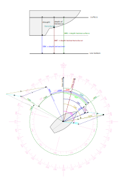

# Calculated Data

The plugin calculates true wind, ground wind, set and drift. It needs COG/SOG, HDT/STW and AWA/AWS as input data. If HDT/STW is missing it uses COG/SOG as fallback (you get ground wind instead of true wind, and the direction is wrong if HDT!=COG). If you do not have a wind sensor, you can enter ground wind in the settings for testing purposes.

What is calculated by this plugin?

- magnetic variation - is calculated at current position based on the [World Magnetic Model](https://www.ncei.noaa.gov/products/world-magnetic-model).
- true heading - from magnetic heading and variation
- set and drift - from ground track and water track
- depth below surface - from depth below transducer and configured depth of transducer
- true and ground wind - from apparent wind and course data
- leeway is estimated

How the calculation is done and the formulas used as well definitions of the several quantities, is [documented in the code itself](../Sail_Instrument/plugin.py#L640) and described below.

The values calculated by the plugin are published in AvNav as `gps.sail_instrument.*`.
Optionally the plugin can [emit NMEA sentences](../Sail_Instrument/plugin.py#L114) to make the computed data available to other devices. If decoding of own NMEA sentences is enabled, these data are fed back into AvNav, get parsed and written to their standard paths in `gps.*`.
The following values are computed or copied from their sources.

| Quantity | Meaning                                                                                                   | AvNav-Path               | NMEA-Sentence |
|----------|-----------------------------------------------------------------------------------------------------------|--------------------------|---------------|  
| AWA      | apparent wind angle, measured by wind direction sensor                                                    | gps.windAngle            | MWV           |
| AWAF     | apparent wind angle , filtered                                                                            |                          |               |
| AWD      | apparent wind direction, relative to true north                                                           |                          |               |
| AWDF     | apparent wind direction, filtered                                                                         |                          |               |
| AWS      | apparent wind speed, measured by anemometer                                                               | gps.windSpeed            | MWV           |
| AWSF     | apparent wind speed filtered                                                                              |                          |               |
| COG      | course over ground, usually from GPS                                                                      | gps.track                |               |
| CRS      | course through water                                                                                      |                          |               |
| DBK      | depth below keel                                                                                          | gps.depthBelowKeel       |               |
| DBS      | depth below surface                                                                                       | gps.depthBelowWaterline  | DBS           |
| DBT      | depth below transducer                                                                                    | gps.depthBelowTransducer | DBT           |
| DEV      | magnetic deviation, boat specific, depends on HDG                                                         | gps.magDeviation         | HDG           |
| DFT      | tide drift rate                                                                                           | gps.currentDrift         | VDR           |
| DFTF     | tide drift rate filtered                                                                                  |                          |               |
| DOT      | depth of transducer                                                                                       |                          |               |
| DRT      | draught                                                                                                   |                          |               |
| GWA      | ground wind angle, relative to ground, relative to HDT                                                    |                          |               |
| GWD      | ground wind direction, relative to ground, relative true north                                            |                          |               |
| GWS      | ground wind speed, relative to ground                                                                     |                          |               |
| HDC      | compass heading, raw reading of the compass (also HDGc)                                                   | gps.headingCompass       | HDG           |
| HDG      | heading, unspecified which of the following                                                               |                          |               |
| HDM      | magnetic heading, as reported by a calibrated compass (also HDGm)                                         | gps.headingMag           | HDM           |
| HDT      | true heading, direction bow is pointing to, relative to true north (also HDGt)                            | gps.headingTrue          | HDT           |
| HEL      | heel angle, measured by sensor or from heel polar TWA/TWS -> HEL                                          |                          |               |
| LAT      | Latitude                                                                                                  | gps.lat                  |               |
| LAY      | layline angle rel. to TWD                                                                                 |                          |               |
| LEE      | leeway angle, angle between HDT and direction of water speed vector                                       |                          |               |
| LEF      | leeway factor                                                                                             |                          |               |
| LON      | Longitude                                                                                                 | gps.lon                  |               |
| POLAR    | Polar Speed Vector                                                                                        |                          |               |
| SET      | set, direction of tide/current, cannot be measured directly                                               | gps.currentSet           | VDR           |
| SETF     | tide set direction filtered                                                                               |                          |               |
| SOG      | speed over ground, usually from GPS                                                                       | gps.speed                |               |
| STW      | speed through water, usually from paddle wheel, water speed vector projected onto HDT (long axis of boat) | gps.waterSpeed           |               |
| TWA      | true wind angle, relative to water, relative to HDT                                                       | gps.trueWindAngle        | MWV           |
| TWAF     | true wind angle, filtered                                                                                 |                          |               |
| TWD      | true wind direction, relative to water, relative true north                                               | gps.trueWindDirection    | MWD           |
| TWDF     | true wind direction filtered                                                                              |                          |               |
| TWDMAX   | max true wind direction relative                                                                          |                          |               |
| TWDMIN   | min true wind direction relative                                                                          |                          |               |
| TWS      | true wind speed, relative to water                                                                        | gps.trueWindSpeed        | MWD           |
| TWSF     | true wind speed filtered                                                                                  |                          |               |
| VAR      | magnetic variation, given in chart or computed from model                                                 | gps.magVariation         | HDG           |
| VMCA     | optimum VMC direction (course)                                                                            |                          |               |
| VMCB     | optimum VMC direction (opposite                                                                           |                          |               |
| VMG      | velocity made good upwind                                                                                 |                          |               |
| VPOL     | speed from polar                                                                                          |                          |               |

## Magnetic Variation

The plugin is able to calculate the [magnetic variation](https://en.wikipedia.org/wiki/Magnetic_declination) at your current position.
It is using the [World Magnetic Model](https://www.ncei.noaa.gov/products/world-magnetic-model).
The WMM2020 Coefficient file ([wmm2020.cof](../Sail_Instrument/lib/WMM2020.COF)) valid for 2020 - 2025 is included in the software package. The calculation is done with the [geomag-library](https://github.com/cmweiss/geomag). The coefficient file and the library are located in the [`lib` subdirectory](../Sail_Instrument/lib).

## Equations

### Depth Data

The computation of depth data is very straight forward, you enter `draught` and `depth_transducer` in the plugin configuration and depth below surface (DBS) and depth below keel (DBK) are computed.

- DBS = DBT + DOT
- DBK = DBS - DRT

### Heading

$$ HDT = HDM + VAR $$

### Leeway and Course

$$ LEE = LEF \cdot HEL / STW^2 $$

$$ CRS = HDT + LEE $$

With leeway factor \$LEF = 0..20\$, boat specific

### Speeds

The computation of speeds is somewhat more complex since it involves vector addition of vectors in polar representation.

The \$\oplus\$ operator denotes the [addition of polar vectors](https://math.stackexchange.com/questions/1365622/adding-two-polar-vectors).

#### Tide

$$ [SET,DFT] = [COG,SOG] \oplus [CRS,-STW] $$

#### Wind

angles and directions are always converted like

$$ [TWA,TWS] = [AWA,AWS] \oplus [LEE,-STW] $$

$$ TWD = TWA + HDT $$

$$ [GWD,GWS] = [AWA+HDT,AWS] \oplus [COG,-SOG] $$