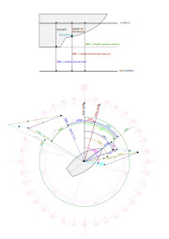

# Calculated Data

The plugin calculates true wind, ground wind, set and drift. It needs COG/SOG, HDT/STW and AWA/AWS as input data. If HDT/STW is missing it uses COG/SOG as fallback (you get ground wind instead of true wind, and the direction is wrong if HDT!=COG). If you do not have a wind sensor, you can enter ground wind in the settings for testing purposes.

What is calculated by this plugin?

- magnetic variation - is calculated at current position based on the [World Magnetic Model](https://www.ncei.noaa.gov/products/world-magnetic-model).
- true heading - from magnetic heading and variation
- set and drift - from ground track and water track
- depth below surface - from depth below transducer and configured depth of transducer
- true and ground wind - from apparent wind and course data
- leeway is estimated

How the calculation is done and the formulas used as well definitions of the several quantities, is [documented in the code itself](../Sail_Instrument/plugin.py#L640) and described below.

The values calculated by the plugin are published in AvNav as `gps.sail_instrument.*`.
Optionally the plugin can [emit NMEA sentences](../Sail_Instrument/plugin.py#L114) to make the computed data available to other devices. If decoding of own NMEA sentences is enabled, these data are fed back into AvNav, get parsed and written to their standard paths in `gps.*`.
The following values are computed or copied from their sources.

| Quantity | Meaning                                                                                                   | AvNav-Path               | NMEA-Sentence |
|----------|-----------------------------------------------------------------------------------------------------------|--------------------------|---------------|  
| AWA      | apparent wind angle, measured by wind direction sensor                                                    | gps.windAngle            | MWV           |
| AWAF     | apparent wind angle , filtered                                                                            |                          |               |
| AWD      | apparent wind direction, relative to true north                                                           |                          |               |
| AWDF     | apparent wind direction, filtered                                                                         |                          |               |
| AWS      | apparent wind speed, measured by anemometer                                                               | gps.windSpeed            | MWV           |
| AWSF     | apparent wind speed filtered                                                                              |                          |               |
| COG      | course over ground, usually from GPS                                                                      | gps.track                |               |
| CRS      | course through water                                                                                      |                          |               |
| DBK      | depth below keel                                                                                          | gps.depthBelowKeel       |               |
| DBS      | depth below surface                                                                                       | gps.depthBelowWaterline  | DBS           |
| DBT      | depth below transducer                                                                                    | gps.depthBelowTransducer | DBT           |
| DEV      | magnetic deviation, boat specific, depends on HDG                                                         | gps.magDeviation         | HDG           |
| DFT      | tide drift rate                                                                                           | gps.currentDrift         | VDR           |
| DFTF     | tide drift rate filtered                                                                                  |                          |               |
| DOT      | depth of transducer                                                                                       |                          |               |
| DRT      | draught                                                                                                   |                          |               |
| GWA      | ground wind angle, relative to ground, relative to HDT                                                    |                          |               |
| GWD      | ground wind direction, relative to ground, relative true north                                            |                          |               |
| GWS      | ground wind speed, relative to ground                                                                     |                          |               |
| HDC      | compass heading, raw reading of the compass (also HDGc)                                                   | gps.headingCompass       | HDG           |
| HDG      | heading, unspecified which of the following                                                               |                          |               |
| HDM      | magnetic heading, as reported by a calibrated compass (also HDGm)                                         | gps.headingMag           | HDM           |
| HDT      | true heading, direction bow is pointing to, relative to true north (also HDGt)                            | gps.headingTrue          | HDT           |
| HEL      | heel angle, measured by sensor or from heel polar TWA/TWS -> HEL                                          |                          |               |
| LAT      | Latitude                                                                                                  | gps.lat                  |               |
| LAY      | layline angle rel. to TWD                                                                                 |                          |               |
| LEE      | leeway angle, angle between HDT and direction of water speed vector                                       |                          |               |
| LEF      | leeway factor                                                                                             |                          |               |
| LON      | Longitude                                                                                                 | gps.lon                  |               |
| POLAR    | Polar Speed Vector                                                                                        |                          |               |
| SET      | set, direction of tide/current, cannot be measured directly                                               | gps.currentSet           | VDR           |
| SETF     | tide set direction filtered                                                                               |                          |               |
| SOG      | speed over ground, usually from GPS                                                                       | gps.speed                |               |
| STW      | speed through water, usually from paddle wheel, water speed vector projected onto HDT (long axis of boat) | gps.waterSpeed           |               |
| TWA      | true wind angle, relative to water, relative to HDT                                                       | gps.trueWindAngle        | MWV           |
| TWAF     | true wind angle, filtered                                                                                 |                          |               |
| TWD      | true wind direction, relative to water, relative true north                                               | gps.trueWindDirection    | MWD           |
| TWDF     | true wind direction filtered                                                                              |                          |               |
| TWDMAX   | max true wind direction relative                                                                          |                          |               |
| TWDMIN   | min true wind direction relative                                                                          |                          |               |
| TWS      | true wind speed, relative to water                                                                        | gps.trueWindSpeed        | MWD           |
| TWSF     | true wind speed filtered                                                                                  |                          |               |
| VAR      | magnetic variation, given in chart or computed from model                                                 | gps.magVariation         | HDG           |
| VMCA     | optimum VMC direction (course)                                                                            |                          |               |
| VMCB     | optimum VMC direction (opposite                                                                           |                          |               |
| VMG      | velocity made good upwind                                                                                 |                          |               |
| VPOL     | speed from polar                                                                                          |                          |               |

## Magnetic Variation

The plugin is able to calculate the [magnetic variation](https://en.wikipedia.org/wiki/Magnetic_declination) at your current position.
It is using the [World Magnetic Model](https://www.ncei.noaa.gov/products/world-magnetic-model).
The WMM2020 Coefficient file ([wmm2020.cof](../Sail_Instrument/lib/WMM2020.COF)) valid for 2020 - 2025 is included in the software package. The calculation is done with the [geomag-library](https://github.com/cmweiss/geomag). The coefficient file and the library are located in the [`lib` subdirectory](../Sail_Instrument/lib).

## Polar Speed

You have to provide polar data for your boat in `avnav/user/viewer/polar.json` for the calculation of the laylines, polar speed and optimum VMC course. If there is no such file, the plugin will copy [an example file](../Sail_Instrument/polar.json) to this location, and you can use it as a template for your own polar data.

If you do not have any polar data, you can enter tack and gybe angle in the plugin configuration and use these fixed values instead.

A source for polar data can be [ORC sailboat data](https://jieter.github.io/orc-data/site/) or [Seapilot.com](https://www.seapilot.com/features/download-polar-files/).

## Laylines

To understand the technical background of the [laylines](https://en.wikipedia.org/wiki/Layline) one has first to have an understanding of the terms VMG and VMC.

- **VMG** - _Velocity Made Good against
  wind_ is defined as `VMG = boatspeed * cos(TWA)` boatspeed vector projected onto true wind direction
- **VMC** - _Velocity Made good on
  Course_ is defined as `VMC = boatspeed * cos(BRG-HDG)` boatspeed vector projected onto direction to waypoint

Unfortunately there is a lot of confusion on these two terms and also most of the commercial products are mixing the two items and indicate VMG but actually showing VMC (and so does AvNav).

The laylines are computed from the `beat_angle` and `run_angle` vectors in the polar file, which contain a mapping of TWS to TWA for maximum VMG. As a result the laylines show the optimal TWA to travel upwind in general, but not the optimal TWA to get towards the waypoint.
Optionally it is also possible to calculate the laylines from the STW matrix.

From the `STW` matrix in the polar data, which is a mapping of TWS and TWA to STW, one can calculate the _optimal
TWA_ (red) such that _VMC is maximised_ (purple).

## Leeway estimation

Leeway is [estimated from heel and STW](https://opencpn-manuals.github.io/main/tactics/index.html#_2_2_calculate_leeway) as

$$ LEE = LEF \cdot HEL / STW^2 $$

With LEF being a boat specific factor from within (0,20). Heel could be a measured value (either from `signalk.navigation.attitude.roll` or a specific transducer in `gps.transducers.ROLL`). If this data is not available it is interpolated from the heel polar in [`avnav/user/viewer/heel.json`](../Sail_Instrument/heel.json). As the `polar.json` it contains an interpolation table to map TWA/TWS to heel angle HEL.

## Equations

### Depth Data

The computation of depth is very straight forward, you enter `draught` and `depth_transducer` in the plugin configuration and depth below surface (DBS) and depth below keel (DBK) are computed.

$$ DBS = DBT + DOT $$

$$ DBK = DBS - DRT $$

### Heading

True heading is computed from magnetic heading and magnetic variation. To get magnetic heading from a compass, you have to correct for compass deviation (DEV) as well. The values of DEV depends on the heading. A self calibrating electronic compass usually gives you magnetic or even true heading directly.

$$ HDT = HDM + VAR = HDC + DEV + VAR $$

### Course

Course through water is heading plus leeway. Leeway is estimated as described above.

$$ CRS = HDT + LEE $$

### Speeds

The computation of speed vectors is somewhat more complex since it involves the addition of vectors in polar representation.

The \$\oplus\$ operator denotes the [addition of polar vectors](https://math.stackexchange.com/questions/1365622/adding-two-polar-vectors).

#### Tide

The tide or current vector can be estimated as the difference of COG and SOG obtained from GPS and heading from compass + estimated leeway and water speed from the paddle wheel log.

$$ [SET,DFT] = [COG,SOG] \oplus [CRS,-STW] $$

This equation corresponds to the triangle/parallelogram on the right side of the boat in the sketch above.

#### Wind

In general, angles (xxA, relative to heading) and directions (xxD rel. to true north) are always converted by adding/subtracting true heading HDT.

True wind, which is the wind vector relative to water, can be obtained from apparent wind measured by the wind meter (direction and speed) and water speed. To get the angle right, leeway also enters the equation.

$$ [TWA,TWS] = [AWA,AWS] \oplus [LEE,-STW] $$

To get the true wind direction from the angle, just add true heading.

$$ TWD = TWA + HDT $$

To calculate ground wind (wind vector relative to ground), we use course and speed over ground instead. To convert apparent wind angle to a direction, again, just add true heading.

$$ [GWD,GWS] = [AWA+HDT,AWS] \oplus [COG,-SOG] $$

These equation correspond to the left triangle in the sketch above.